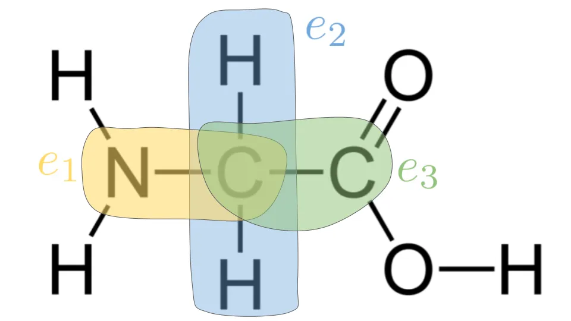

This is my class project for CS224W: Machine Learning on Graphs, done in collaboration with Alec Lessing and Matt Wolff. I'll skip the details here, but you can [see our in-depth Medium post](https://medium.com/@sergiogcharles/funce-gnn-protein-function-prediction-using-multi-task-and-relational-graph-learning-74f972a776f9).

The task was to predict whether or not a protein possesed a particular functional property. We used AlphaFold 2's protein structure predictions. Each node in the input graph represents an atom with features consisting of the 3D atom coordinates and the one-hot-encoded atom type. We also augmented these features with cycle counts, in order to surpass the expressivity limitations of the WL isomorphism test. More precisely, in the naive setting, the feature for node $$i$$ is its one-hot-encoded atom type, a number representing the number of protons in the atom. In our dataset, the only atom types are Boron, Carbon, Nitrogen, Sulfur so we use a 4-dimensional one-hot encoding for atom type. To make the GNN more expressive, the feature for node $$i$$ will be augmented by:

$$
\mathbf{s}_i=[\text{diag}(A^0)_{i,i}, \text{diag}(A^1)_{i,i}, \dots, \text{diag}(A^{K-1})_{i,i}]\in\mathbb{R}^K.
$$

where the $$(i,i)$$ entry of the diagonal of the $$k$$-th power of the adjacency matrix $$A$$ corresponds to the number of $$k$$-length cycles node $$i$$ resides in. In fact, [in the recent work of Kanatsoulis et al.](https://ieeexplore.ieee.org/document/10447704), it was shown that a Graph Isomorphism Network (the most powerful GNN in the class of message-passing GNNs) with such structural initial node features is strictly more powerful than the WL test!

We view the protein graph as a heterogenous graph, whereby (source_atom_type, distance_target_atom_type) is an edge type. In our setting, this is equivalent to a relation type. For instance, in the glycine amino acid molecule shown below, (Carbon, Hydrogen) is distinct from (Carbon, Nitrogen). Intuitively, we should treat the graph as heterogenous so the message-passing GNN can distinguish edge types. In our dataset, there are 16 unique edge types.

Furthermore, we introduced a low-rank decomposition, such that the weight matrix for each relation in the message passing operation was decomposed as:
\begin{equation}
W_r=W_{\text{shared}} + A_r B_r
\end{equation}
where $$W_{\text{shared}}\in\mathbb{R}^{F\times F'}$$ is a shared weight matrix and $$A_r\in\mathbb{R}^{F\times r}$$, $$B_r\in\mathbb{R}^{r\times F'}$$ are two low-rank matrices such that $$r<<\min(F, F')$$ Laslty, a multi-task learning framework was employed, whereby each protein function was treated as a separate task with an embedding that we conditioned on. 